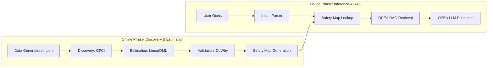

# 🏗️ System Architecture: Two-Phase Design

CDIE v4 (Causal Decision Intelligence Engine) follows a decoupled **Offline Pipeline** and **Online API** architecture to ensure low-latency causal intervention lookups while maintaining the high-computational rigor of causal discovery and estimation.

---

## 🔁 Overview: Two Phases

---

## 📂 1. Offline Phase (Causal Discovery & Estimation)

The offline phase executes the "heavy lifting" to generate a **Safety Map** (a look-up table of validated causal effects).

### 8-Step Pipeline

1. **Data Generation/Import**: CDIE v4 uses a known-ground-truth DAG to generate synthetic telecom data (5,000 samples) or imports real operator data.
2. **CATL (Causal Assumption Transparency Layer)**: Performs statistical tests for faithfulness, sufficiency (no unobserved confounders), and positivity.
3. **GFCI Discovery (Greedy Fast Causal Inference)**: Discovers the causal structure (PAG/DAG) from observational data.
4. **PCMCI+ Temporal Analysis**: Identifies time-lagged causal relationships (e.g., "Policy change today" → "Fraud reduction 2 periods later").
5. **DoWhy Refutation**: A 3-test suite (Placebo, Random Common Cause, Data Subset) to verify each discovered edge.
6. **LinearDML Estimation**: Uses Doubly-Robust Machine Learning (EconML) for heterogeneous treatment effect estimation.
7. **MAPIE Confidence Intervals**: Generates 95% conformal prediction intervals for every effect estimate.
8. **Safety Map Export**: Final results are hashed and exported to a SQLite/JSON cache for the API.

---

## 2. ⚡ Online Phase (FastAPI + OPEA RAG Pipeline)
The online phase provides sub-200ms latency for causal queries and natural language briefing using Intel's OPEA microservices.

### Data Flow:
1.  **Intent Parser**: A rule-based parser classifies natural language queries into 4 types: *Intervention*, *Counterfactual*, *Root Cause*, and *Temporal*.
2.  **Fast Lookup**: Queries are matched against the pre-computed **Safety Map** to retrieve high-precision causal statistics.
3.  **TEI Semantic Retrieval**: OPEA **TEI Embedding** service retrieves relevant "Fraud Playbooks" from the knowledge base.
4.  **TEI Reranking**: OPEA **TEI Reranker** ensures the top-scoring playbook context is passed to the LLM.
5.  **GenAI Briefing**: OPEA **LLM TextGen** (Intel/neural-chat-7b-v3-3) generates a structured "OPEA Causal Intelligence Report" combining causal evidence with playbook recommendations.

---

## 3. 🛠️ Tech Stack & Infrastructure
CDIE v4 is built for enterprise deployment on **Intel Xeon** hardware:
- **Python Backend**: FastAPI, Pandas, Scikit-learn, Causal-learn, DoWhy, EconML.
- **Intel Optimizations**: AMX/AVX-512 acceleration through OPEA microservices (`DNNL_MAX_CPU_ISA=AVX512_CORE_AMX`).
- **Containerization**: Orchestrated via Docker Compose with 7 integrated containers.
