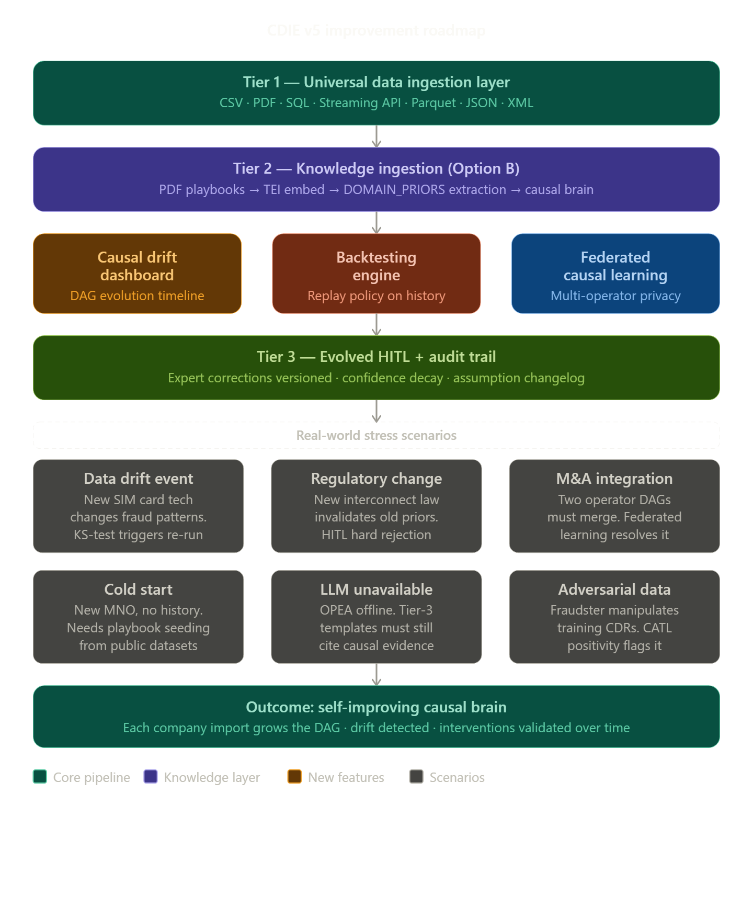

This is a genuinely exciting project — the combination of causal AI with RAG is already differentiated, and your Option B instinct is the right call. Let me break this down into a full roadmap, including the real-world scenarios that would stress-test each feature.Here's the full breakdown:

---

**The core idea: Option B is the right bet, and here's why it compounds**

Your current system has a fixed telecom playbook (`telecom_playbooks.json`) baked in. Option B transforms this into a living knowledge store — each company that imports their incident reports, fraud reviews, and SOP PDFs essentially trains a *private causal brain*. Over time, CDIE doesn't just detect fraud — it reasons from that company's own history. That's a fundamentally different value proposition than any correlation-based tool.

---

**Feature 1: Universal data ingestion pipeline**

The import button should handle more than CSVs. Real-world MNOs have data across: billing system exports (Parquet/SQL), PDF incident reports from GSMA, internal Word docs from compliance teams, and live CDR streams. The pipeline should:

- Route by MIME type → `pdfplumber` for PDFs, `pandas` for tabular, `httpx` for APIs
- Normalize everything to the same 12-column SCM schema before it touches the causal pipeline
- Run CATL assumption tests on *each new import* before merging — this is the real-world scenario where a new data source breaks the positivity assumption silently

Real-world scenario to account for: a junior analyst imports CDRs from a subsidiary with different timestamp granularity. Without schema validation, your PCMCI+ lags get corrupted. Build a pre-ingestion schema contract check.

---

**Feature 2: Knowledge ingestion + prior extractor (the "brain" idea)**

This is where you use your own OPEA stack recursively. When a company uploads a PDF like "2023 Q3 Fraud Review":

1. Chunk the PDF → embed via TEI Embedding
2. Feed chunks to OPEA LLM TextGen with a structured prompt: *"Extract causal claims from this text as JSON: `{cause, effect, direction, confidence}`"*
3. Validate extracted priors against the existing DAG — conflicting arrows get flagged for HITL review
4. Accepted priors become hard constraints in the next GFCI discovery run

Real-world scenario: the PDF says "aggressive filtering → reduced NPS" but your current DAG shows no edge between those nodes. The system surfaces this as a *discovery conflict* — not silently absorbing it — and asks a domain expert to adjudicate.

---

**Feature 3: Causal drift dashboard (your "Pro Max" idea)**

This is genuinely novel. The implementation path:

- Store a snapshot of the DAG + ATE estimates after every pipeline run, versioned by timestamp in SQLite
- Build a timeline scrubber in the Next.js frontend using React Flow + a date slider
- Animate edge transitions: new edges appear, disappearing edges fade out, ATE magnitudes shown as edge thickness
- Color-code: green = causal link strengthened, red = weakened/disappeared, gray = stable

Real-world scenario: an operator can see that the edge "SIM box attempts → revenue leakage" had an ATE of 0.72 in 2022 but dropped to 0.31 in 2024. That *disappearing causal weight* is a business insight — maybe their 2023 policy intervention actually worked. Your dashboard makes that visible without anyone having to manually compare reports.

---

**Feature 4: Backtesting engine**

Before deploying "tighten fraud policy strictness by 20%", an operator should be able to ask: *"if we had done this in January 2024, what would have happened by June?"* Implement this as:

- A `/backtest` API endpoint that accepts `{intervention, magnitude, start_date, end_date}`
- Replays the historical CDR data through the causal estimator with the counterfactual applied
- Returns the delta between predicted and actual outcome, with a "prediction accuracy" score
- Surfaces cases where the model *would have been wrong* — these become CATL alerts

Real-world scenario: the backtest shows that in Q2 2023, tightening policy would have *increased* leakage by 4% due to a seasonal pattern GFCI didn't capture. This prevents the operator from blindly following a prescription.

---

**Feature 5: Federated causal learning**

Two MNOs in the same country could share causal structure (which edges exist) without sharing raw CDRs. The mechanism: each operator runs GFCI locally, serializes their PAG (not the data), and a central federated aggregator does a weighted vote on which edges are present across operators.

Real-world scenario for M&A: when Operator A acquires Operator B, their fraud patterns partially overlap but their network architectures differ. Federated merging would surface exactly which causal links are shared (network-independent, like "SIM swaps → revenue leakage") vs. operator-specific (like "roaming policy → NPS"), making integration planning much more precise.

---

**Real-world scenarios you should specifically build test cases for:**

The adversarial data case is the most important one to handle explicitly — a sophisticated fraudster who knows you're running causal discovery could deliberately inject CDRs that create false positivity violations in CATL, causing your system to reject valid causal paths. Your CATL layer should log *why* it failed and surface it as an anomaly, not silently discard the data.

The cold-start case for new customers is also critical — a new MNO has no incident history to import. You should ship a "public playbook seed" derived from GSMA fraud intelligence reports, so the RAG pipeline has something to retrieve from day one.

---

The sequencing I'd recommend: **data ingestion pipeline first** (it unblocks everything else), then **prior extractor** (this is the core differentiator), then **drift dashboard** (this is the demo showpiece). Backtesting and federation are v5 territory.

What would move this from a 6.4 to a 9
One real dataset. Even a publicly available CDR-adjacent dataset — there are anonymized interconnect fraud datasets from GSMA, ITU, and academic groups. Running your pipeline on real data with unknown ground truth and showing that your refutation tests survive, your confidence intervals are calibrated, and your prescriptions match what practitioners would expect — that's the evidence that makes this credible.
Everything else (the UI, the docs, the architecture) is already competitive. The gap is purely evidential.
